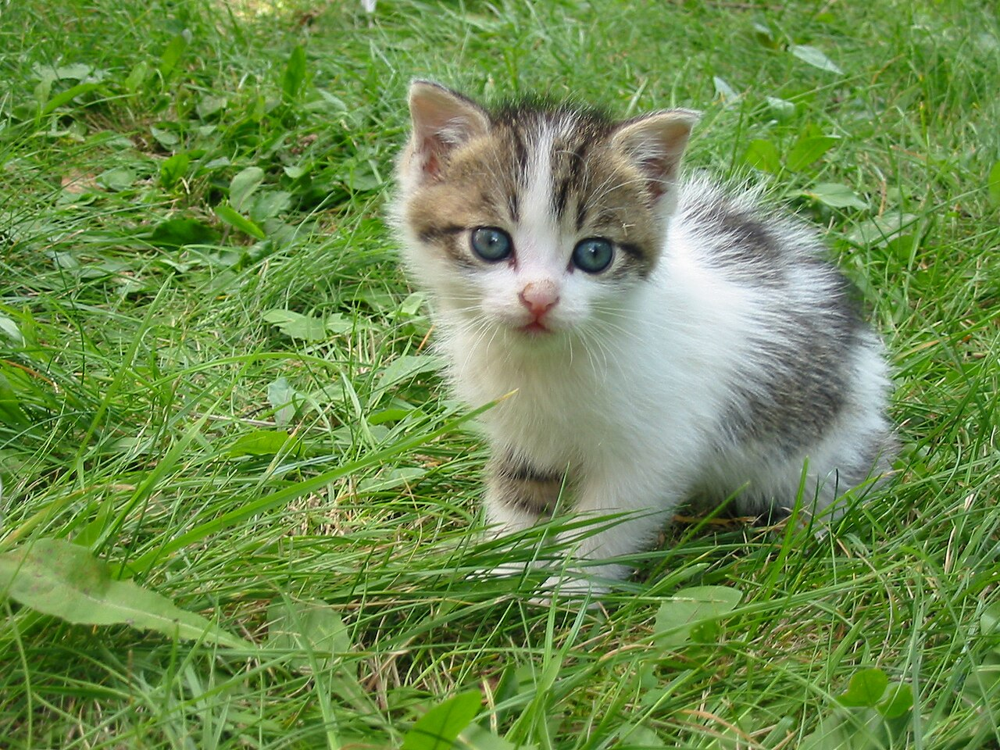

# H1 overskrift

## H2 overskrift

### H3 overskrift

#### H4 overskrift

##### H5 overskrift

Hei jeg heter **Maria**, jeg er 17 år gammel og går IT på _Breivang VGS_. 
Jeg har tegnet nesten hele _livet_ mitt, så jeg er **ganske** god på det. 
Jeg er litt **nervøs**, men ganske **spent** for å komme meg ut i arbeidslivet. 

Her er noen av hobbyene mine:
* Tegning
* lesing
* videospill

Og her er noen mål jeg har for skoleåret:
1. Bli god på koding
2. Bygge portfolioen min
3. Kunne bygge å reparere pc-er

Ikke ["Klikk her"](https://artfight.net/) 

Sitat:

> “I'm selfish, impatient and a little insecure. I make mistakes, I am out of control and at times hard to handle. But if you can't handle me at my worst, then you sure as hell don't deserve me at my best.”
> ― Marilyn Monroe

linebreak: 

I love cats they're so cute and playful, I hope I can own a million cats in the future.

---

I also love dogs, they're so friendly and energetic, but a bit too much for me. 

Forklaring av html taggene "H1-H6": 

H1-H6 er det samme som hashtaggene i markdown, de manipulerer størrelsen av teksten. H1 er den største og H6 er den minste. 
